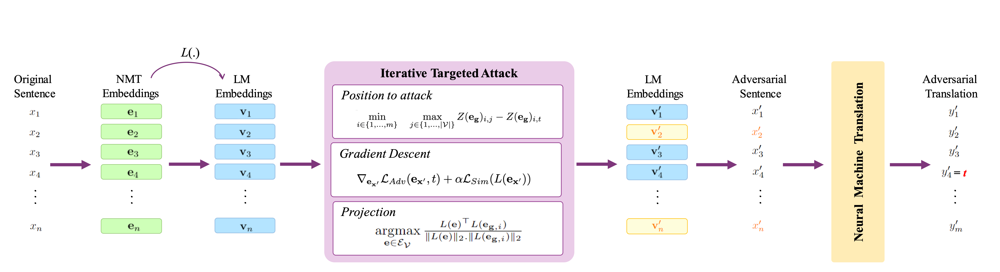

# Targeted Adversarial Attacks against Neural Machine Translation 

This is the official repository of the paper [**"Targeted Adversarial Attacks against Neural Machine Translation "**](https://arxiv.org/abs/2303.01068.pdf), the targeted white-box adversarial attack against NMT systems. 



## Installation
Install [conda](https://conda.io) and run the steps below:
```
$ git clone https://github.com/sssadrizadeh/NMT-targeted-attack.git
$ cd NMT-targeted-attack
$ conda env create --file=env.yml
$ conda activate attack
```

The datsets and models are available in the HuggingFace transformers package.

## Performing targeted adversarial attack against NMT models
To attack a translation model, Marian NMT or mBART50, run the following code:
```sh
$ python TransFool/white_box_attack.py --num_samples 1000 --w_sim 10 4 2 --model_name marian --target_lang fr --dataset_config_name fr-en --dataset_name wmt14 --result_folder results --Nth 2
```
This code generates adversarial examples against Marian NMT for the samples 0-1000 of the WMT14 (Fr-En) dataset. The adversarial attack chosses the second most probable token as the target keyword (Nth = 2). To use the code to insert a pre-defined keyword (such as *guerre*) to the translation, use the option --attack_target guerre instead of --Nth 2.

After running the code, a pickle file of the results are generated which can be evaluted by:
```sh
$ python EvaluateAttack.py --num_samples 1000 --target_model_name marian --target_lang fr --result_folder results --attack_type white_box --attack_alg TransFool --w_sim 10 4 2 --Nth 2
```
This code evaluates the attack in terms of the average semantic similarity between the original sentences  and the adversarial, the token error rate, the success attack rate, and relative decrease in translation quality.


## Citation
If you found this repository helpful, please don't forget to cite our paper:
```BibTeX
@inproceedings{sadrizadeh2023Targeted,
  title = {Targeted Adversarial Attacks against Neural Machine Translation},
  author = {Sahar Sadrizadeh, AmirHossein Dabiri Aghdam, Ljiljana Dolamic, and Pascal Frossard},
  booktitle = {ICASSP 2023 IEEE International Conference on Acoustics, Speech and Signal Processing (ICASSP)},
  year = {2023}
}
```
In case of any question, please feel free to contact  [sahar.sadrizadeh@epfl.ch](mailto:sahar.sadrizadeh@epfl.ch).